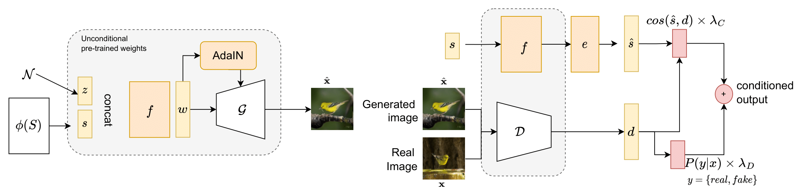
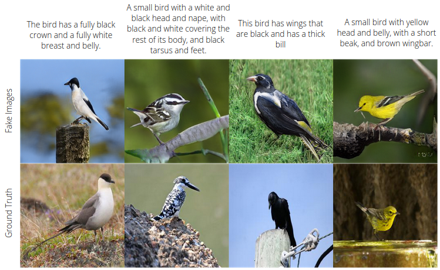

## Teaching StyleGAN to Read: Improving Text-to-image Synthesis with U2C Transfer Learning<br>

Pytorch implementation for reproducing Text-Conditional Stylegan2 (TC-Stylegan2), in the paper Teaching StyleGAN to Read: Improving Text-to-image Synthesis with U2C Transfer Learning, by Vinicius Pereira and Jonatas Werhmann.



The core architecture was adapted from **[Stylegan3](https://github.com/NVlabs/stylegan3). ** We introduce few modifications to generate text-conditioned images.





## Requirements

* 64-bit Python 3.8 and PyTorch 1.9.0 (or later). See https://pytorch.org for PyTorch install instructions.
* CUDA toolkit 11.1 or later. 

* Python libraries: see [environment.yml](./environment.yml) for exact library dependencies.  You can use the following commands with Miniconda3 to create and activate your StyleGAN3 Python environment:
  - `conda env create -f environment.yml`
  - `conda activate stylegan3`


## Preparing datasets


* To prepare the dataset, make sure that you have the embeddings processed and save in a pickle dictionary with the key equal to the image file name. The embedding source is a dictionary with the image_path as a key, and the captions encoded as values. The source is a folder with the images resized to a specific shape (256x256, for example);

- ```python dataset_tool.py --source=~/destination/to/source --dest=~/datasets/dest_name.zip --embedding_source=~/destination/to/embedding_source```


- To Generate and Train DAMSM Embeddings, check: https://github.com/taoxugit/AttnGAN; 

 
## Training

* To train from scratch using ```gamma=0.8192```, ```map-depth=8```, with the data in ```~/datasets/dest_name.zip```. For example, you can run:

``` !python train.py --outdir=~/training_runs --cfg=stylegan2 --data=~/datasets/dest_name.zip --snap=20 --cfg=stylegan2 --gpus=1 --batch=16 --gamma=0.8192 --map-depth=8 --glr=0.0025 --dlr=0.0025 --cbase=16384 --metrics=none --embedding_dim=256  ```


##Citing

```
@inproceedings{Pereira_2022_BMVC,
author    = {Vinicius G Pereira and JONATAS WEHRMANN},
title     = {Teaching StyleGAN to Read: Improving Text-to-image Synthesis with U2C Transfer Learning},
booktitle = {33rd British Machine Vision Conference 2022, {BMVC} 2022, London, UK, November 21-24, 2022},
publisher = {{BMVA} Press},
year      = {2022},
url       = {https://bmvc2022.mpi-inf.mpg.de/0512.pdf}
}
```
